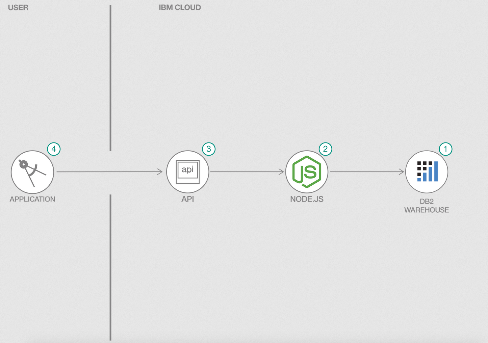

# Create a CRUD application using Node.js and IBM Db2 Warehouse on Cloud

This is an application which uses Node.js to connect to IBM Db2 Warehouse on Cloud for CRUD(create, update, delete) operations. The application showcases how you can create a high performant CRUD application using Node.js and IBM Db2 Warehouse on Cloud.

## Flow

> 

1. Create schema and tables necessary for storing data in IBM Db2 Warehouse on Cloud.
2. Node.js webapp that use node Db2 driver to connect to the database.
3. Node.js app exposes API to interact with IBM Db2 Warehouse on Cloud.
4. An Angular frontend application to collect home sales data and call API to store that data to IBM Db2 Warehouse on Cloud.

## Video

[](https://youtu.be/bdQtPS4OStw)

## Steps

1. [Clone The Repo](#1-clone-the-repo)
2. [Create an IBM Db2 Instance](#2-create-an-ibm-db2-instance)
3. [Create Schema and Tables](#3-create-schema-and-tables)
4. [Add Db2 Credentials to .env File](#4-add-db2-credentials-to-env-file)
5. [Run The Application](#5-run-the-application)

### 1. Clone the repo

```bash
git clone https://github.com/IBM/crud-using-nodejs-and-db2.git
```

### 2. Create an IBM Db2 Instance

Once we have cloned our repository, the next thing we have to do is create our database that will hold our house sales data. There are two ways we can create our database. One way is creating IBM Db2 Warehouse on Cloud. This database will be hosted on the cloud. However, if you prefer to have your database on premise or locally, we can also use the Db2 Docker Image.
 
Choose which type of database you would like and follow the corresponding instructions:

1. [Create IBM Db2 Warehouse on Cloud](#2a-create-ibm-db2-warehouse-on-cloud)
2. [Create IBM Db2 Database Locally Using Docker Image](#2b-create-an-ibm-db2-on-premise-database)

#### 2a. Create IBM Db2 Warehouse on Cloud

Create the Db2 Warehouse on Cloud service and make sure to note the credentials using the following link:

* [**IBM Db2 Warehouse on Cloud**](https://cloud.ibm.com/catalog/services/db2-warehouse)

#### 2b. Create an IBM Db2 On Premise Database

Instead of creating the Db2 Warehouse on Cloud service, we can also have our database instantiated locally by using the free IBM Db2 Docker Image.

Prerequisite:

* A [Docker](https://www.docker.com) account
* [Docker Desktop](https://www.docker.com/products/docker-desktop) installed on your machine
* Logging into your Docker account on Docker Desktop

Steps to get your db2 running locally:

* Create a folder name `db2`
* Open a terminal window and make sure your current directory is the same as where your `db2` is located
* Run the commands

```bash
docker pull ibmcom/db2

docker run -itd --name mydb2 --privileged=true -p 50000:50000 -e LICENSE=accept -e DB2INST1_PASSWORD=hackathon -e DBNAME= homesalesdb -v db2:/database ibmcom/db2

docker exec -ti mydb2 bash -c "su - db2inst1"
```

Once this is done, it will create a db2 docker container with the follow customizations: 

* IP Address/Domain: `localhost`
* Port: `50000`
* Database name: `homesalesdb`
* Username: `db2inst1`
* Password: `hackathon`


### 3. Create Schema and Tables
Now that we have created our databases, we need to import the data from the csv file into our database. We will be creating a schema called `DB2WML`. The two tables we will create are `HOME_SALES` and `HOME_ADDRESS`. `HOME_SALES` will store the data we retrieve from our csv file. `HOME_ADDRESS` is going to be the addresses associated with each home. 

Depending on which type you have (Cloud or On-Premise), the steps will be a little different. Please follow the corresponding steps:

1. [Create Schema and Tables for IBM Db2 Warehouse on Cloud](#3a-create-schema-and-tables-for-ibm-db2-warehouse-on-cloud)
2. [Create Schema and Tables for IBM Db2 Docker Image](#3b-create-schema-and-tables-for-ibm-db2-docker-image)


#### 3a. Create Schema and Tables for IBM Db2 Warehouse on Cloud

In the Db2 warehouse resource page, click on `Manage` and go to DB2 console by clicking the button `Open Console`. In the console do the following to load your data.

* Click `Load` from the hamburger menu.
* Click `Browse files` or you can drag files, select the [data/home-sales-training-data.csv](data/home-sales-training-data.csv) and click `Next`
* Choose existing schema or create a new one named `DB2WML` by clicking `+ New Schema`
* Create a new table named `HOME_SALES` by clicking `+ New Table` on the schema you created and click `Next`
* Make sure the column names and data types displayed are correct, then click `Next`
* Click `Begin Load` to load the data

We also need to create a table for `HOME_ADDRESS`, which will store the addresses of each house data. We won't be able to use the same instructions we used for `HOME_SALES` since we have no data to load. 

* Click `Run SQL` from the hamburger menu.
* Click `Blank`, which will open a blank sql editor
* Run the command

```bash
CREATE TABLE DB2WML.HOME_ADDRESS (ADDRESS1 VARCHAR(50), ADDRESS2 VARCHAR(50), CITY VARCHAR(50), STATE VARCHAR(5), ZIPCODE INTEGER, COUNTRY VARCHAR(50), HOME_ID INTEGER)
```

Once this is done it will create a table `HOME_SALES` and `HOME_ADDRESS ` under schema `DB2WML` which will be used by the Node.js application.


#### 3b. Create Schema and Tables for IBM Db2 Docker Image

Exit out of the container shell by CONTROL-C. Load the sample data into the onprem Db2 database:

```bash
docker cp data/home-sales-training-data.csv mydb2:home-sales-training-data.csv
```

Run the container and enter into the container shell:

```bash
docker exec -ti mydb2 bash -c "su - db2inst1"
```

Steps To Create Schema and Tables:


* Connect to the database `homesalesdb` NOTE: This command may not work for sometime, since the container takes some time to create the database. If this command doesn work, please wait a couple of minutes and then try again.

```bash
db2 connect to homesalesdb
```

* Create Schema `DB2WML`

```bash
db2 'CREATE SCHEMA DB2WML'
```

* Create Table `HOME_SALES` and `HOME_ADDRESS` within Schema `DB2WML`
 
```bash
db2 'CREATE TABLE DB2WML.HOME_SALES (ID SMALLINT, LOTAREA INTEGER, BLDGTYPE VARCHAR(6),HOUSESTYLE VARCHAR(6), OVERALLCOND INTEGER, YEARBUILT INTEGER, ROOFSTYLE VARCHAR(7), EXTERCOND VARCHAR(2), FOUNDATION VARCHAR(6), BSMTCOND VARCHAR(2), HEATING VARCHAR(4), HEATINGQC VARCHAR(2),CENTRALAIR VARCHAR(1), ELECTRICAL VARCHAR(5), FULLBATH INTEGER, HALFBATH INTEGER, BEDROOMABVGR INTEGER, KITCHENABVGR VARCHAR(2), KITCHENQUAL VARCHAR(2), TOTRMSABVGRD INTEGER, FIREPLACES INTEGER, FIREPLACEQU VARCHAR(2), GARAGETYPE VARCHAR(7), GARAGEFINISH VARCHAR(3), GARAGECARS INTEGER, GARAGECOND VARCHAR(2), POOLAREA INTEGER, POOLQC VARCHAR(2), FENCE VARCHAR(6), MOSOLD INTEGER, YRSOLD INTEGER, SALEPRICE INTEGER )'

db2 'CREATE TABLE DB2WML.HOME_ADDRESS (ADDRESS1 VARCHAR(50), ADDRESS2 VARCHAR(50), CITY VARCHAR(50), STATE VARCHAR(5), ZIPCODE INTEGER, COUNTRY VARCHAR(50), HOME_ID INTEGER)'
```

* Load data from CSV file to table `HOME_SALES`

```bash
db2 'IMPORT FROM ../../../home-sales-training-data.csv OF DEL SKIPCOUNT 1 INSERT INTO DB2WML.HOME_SALES'
```

### 4. Add Db2 credentials to .env file

Copy the local `env.sample` file and rename it `.env`:

```bash
    cp env.sample .env
```

Update the `.env` file with the credentials from your Assistant service.

```bash
    # Copy this file to .env and replace the credentials with
    # your own before starting the app.

    DB_DATABASE=<database name>
    DB_HOSTNAME=<hostname>
    DB_PORT=50000
    DB_UID=<username>
    DB_PWD=<password>
```

### 5. Run the application

```bash
    npm install
    yarn install
```

In a two separate terminals run the following:

```bash
    ng serve --open
```

and

```bash
    node server.js
```

You can go to the UI by running the following URL in the browser: `http://localhost:8888`

## Demo


## Learn more

* **Artificial Intelligence Code Patterns**: Enjoyed this Code Pattern? Check out our other [AI Code Patterns](https://developer.ibm.com/technologies/artificial-intelligence/)

## License

This code pattern is licensed under the Apache License, Version 2. Separate third-party code objects invoked within this code pattern are licensed by their respective providers pursuant to their own separate licenses. Contributions are subject to the [Developer Certificate of Origin, Version 1.1](https://developercertificate.org/) and the [Apache License, Version 2](https://www.apache.org/licenses/LICENSE-2.0.txt).

[Apache License FAQ](https://www.apache.org/foundation/license-faq.html#WhatDoesItMEAN)
