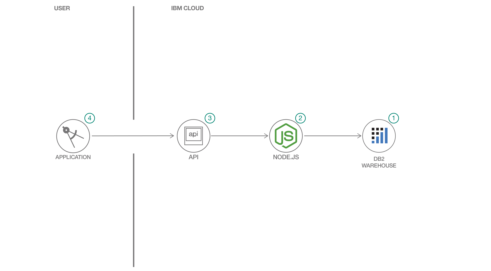

# Create a CRUD application using nodejs and IBM Db2 Warehouse on Cloud

This is an application which uses nodejs to connect to IBM Db2 Warehouse on cloud for CRUD(create, update, delete) operations. The application showcases how you can create a high performant CRUD application using nodejs and IBM Db2 Warehouse on cloud.

## Flow

> 

1. Create schema and tables necessary for storing data in IBM DB2 Warehouse on cloud.
2. Nodejs webapp that use node Db2 driver to connect to the database.
3. Nodejs app exposes API to interact with IBM Db2 Warehouse on cloud.
4. An Angular frontend application to collect home sales data and call API to store that data to IBM Db2 Warehouse on cloud.

## Steps

1. [Clone the repo](#1-clone-the-repo)
1. [Create IBM Db2 Warehouse on Cloud](#2-create-ibm-db2-warehouse-on-cloud)
1. [Create schema and tables](#3-create-schema-and-tables)
1. [Add Db2 credentials to .env file](#4-add-db2-credentials-to-env-file)
1. [Run the application](#5-run-the-application)

### 1. Clone the repo

```bash
git clone https://github.com/IBM/crud-using-nodejs-and-db2.git
```

### 2. Create IBM Db2 Warehouse on Cloud

Create the Db2 Warehouse on Cloud service and make sure to note the credentials using the following link:

* [**IBM Db2 Warehouse on Cloud**](https://cloud.ibm.com/catalog/services/db2-warehouse)

### 3. Create schema and tables

In the Db2 warehouse resource page, click on `Manage` and go to DB2 console by clicking the button `Open Console`. In the console do the following to load your data.

* Click `Load` from the hamburger menu.
* Click `Browse files` or you can drag files, select the [data/home-sales-training-data.csv](data/home-sales-training-data.csv) and click `Next`
* Choose existing schema or create a new one named `DB2WML` by clicking `+ New Schema`
* Create a new table named `HOME_SALES` by clicking `+ New Table` on the schema you created and click `Next`
* Make sure the column names and data types displayed are correct, then cick `Next`
* Click `Begin Load` to load the data

Once this is done it will create a table `HOME_SALES` under schema `DB2WML` which will be used by the nodejs application.

### 4. Add Db2 credentials to .env file

Copy the local `env.sample` file and rename it `.env`:

```bash
    cp env.sample .env
```

Update the `.env` file with the credentials from your Assistant service.

```bash
    # Copy this file to .env and replace the credentials with
    # your own before starting the app.

    DB_DATABASE=<database name>
    DB_HOSTNAME=<hostname>
    DB_PORT=50000
    DB_UID=<username>
    DB_PWD=<password>
```

### 5. Run the application

```bash
    npm install
    yarn install
```

In a two separate terminals run the following:

```bash
    ng serve --open
```

and

```bash
    node server.js
```

You can go to the UI by running the following URL in the browser: `http://localhost:8888`

## Learn more

* **Artificial Intelligence Code Patterns**: Enjoyed this Code Pattern? Check out our other [AI Code Patterns](https://developer.ibm.com/technologies/artificial-intelligence/)

## License

This code pattern is licensed under the Apache License, Version 2. Separate third-party code objects invoked within this code pattern are licensed by their respective providers pursuant to their own separate licenses. Contributions are subject to the [Developer Certificate of Origin, Version 1.1](https://developercertificate.org/) and the [Apache License, Version 2](https://www.apache.org/licenses/LICENSE-2.0.txt).

[Apache License FAQ](https://www.apache.org/foundation/license-faq.html#WhatDoesItMEAN)
